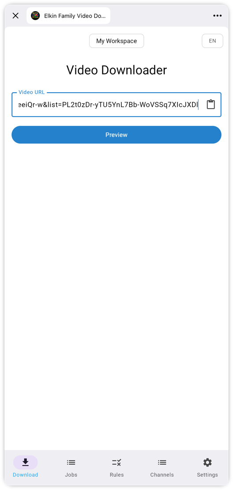
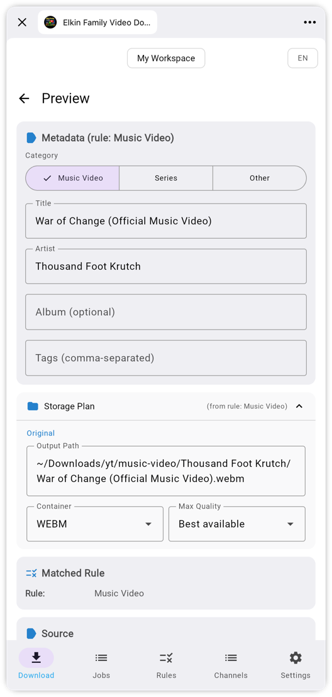
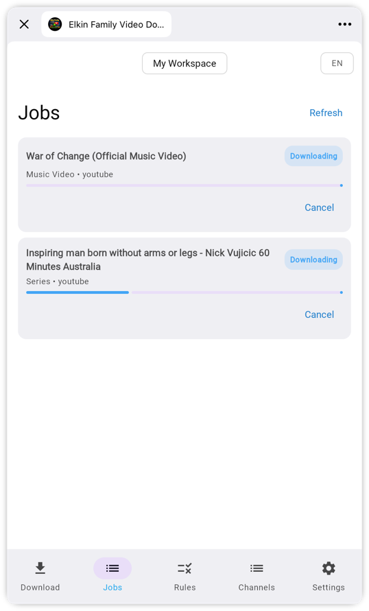
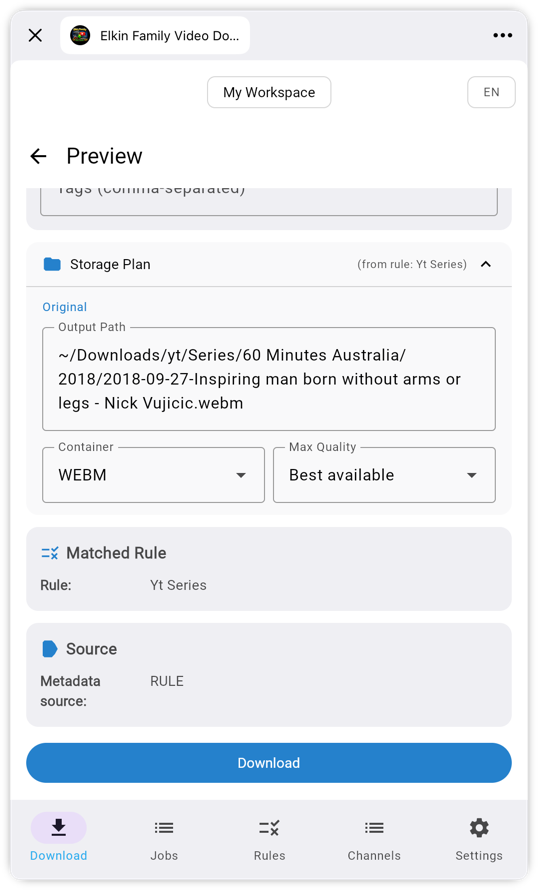

# TG Video Downloader

> **Status**: In Development (MVP)

[](https://github.com/alelk/tg-video-downloader/releases/latest)

[](https://kotlinlang.org)
[](https://ktor.io)
[](https://www.jetbrains.com/lp/compose-multiplatform/)
[](https://www.postgresql.org)
[](LICENSE)

A self-hosted service for downloading videos from YouTube, RuTube, VK Video, and [1000+ other platforms](https://github.com/yt-dlp/yt-dlp/blob/master/supportedsites.md), managed through a Telegram Mini App. Supports smart metadata extraction via LLM (Gemini/OpenAI) and HTTP/SOCKS5 proxies.

---

## ✨ Features

<div align="center">

|                             URL Input                             |                               Metadata Preview                               |                          Job Queue                           |
|:-----------------------------------------------------------------:|:----------------------------------------------------------------------------:|:------------------------------------------------------------:|
|  |  |  |

</div>

- 🎬 **Video downloads** via `yt-dlp` (YouTube, RuTube, VK Video, 1000+ sites)
- 🏷️ **Automatic metadata recognition** — artist, title, season/episode
- 🧠 **Smart metadata via LLM** (Gemini/OpenAI) for new, unknown channels
- 📁 **Rule-based file organization** — flexible folder structure
- 📺 **Channel directory** — tags, per-channel metadata overrides, tag-based rule matching
- ✏️ **Metadata editor** — review and adjust before downloading
- 💾 **Save as rule** — one click to save current settings as a rule for future videos
- 🔄 **Job queue** — progress tracking and automatic retries
- 🌐 **Proxy support** — HTTP and SOCKS5
- 🔐 **Telegram authorization** — via `initData`, user allowlist
- 📱 **Kotlin Multiplatform** — shared codebase for server and clients

---

## 📖 Documentation

| Document                                  | Description                                                    |
|-------------------------------------------|----------------------------------------------------------------|
| [ARCHITECTURE.md](docs/ARCHITECTURE.md)   | Module architecture, KMP strategy, dependency rules            |
| [DOMAIN.md](docs/DOMAIN.md)               | Domain model: sealed classes, value objects, invariants        |
| [API_CONTRACT.md](docs/API_CONTRACT.md)   | HTTP API: endpoints, DTOs, serialization, error format         |
| [DATABASE.md](docs/DATABASE.md)           | PostgreSQL schema, migrations, indexes                         |
| [CONFIGURATION.md](docs/CONFIGURATION.md) | All configuration parameters                                   |
| [SECURITY.md](docs/SECURITY.md)           | Authorization, Telegram initData, security model               |
| [TESTING.md](docs/TESTING.md)             | Testing strategy, KMP tests, examples                          |
| [DEPLOYMENT.md](docs/DEPLOYMENT.md)       | Docker, docker-compose, CI/CD                                  |
| [MAINTENANCE.md](docs/MAINTENANCE.md)     | Maintenance, updating yt-dlp, dependency management            |
| [ADR/](docs/ADR/)                         | Architecture Decision Records                                  |

---

## 🛠️ Tech Stack

| Area              | Technology                                  |
|-------------------|---------------------------------------------|
| Language          | Kotlin 2.3+ (Multiplatform)                 |
| JVM               | 21 LTS                                      |
| Backend framework | Ktor 3.x                                    |
| DI                | Koin 4.x                                    |
| Serialization     | kotlinx.serialization                       |
| Database          | PostgreSQL 16+                              |
| ORM / SQL         | Exposed + exposed-json                      |
| Migrations        | Flyway                                      |
| UI                | Compose Multiplatform                       |
| HTTP Client       | Ktor Client (KMP)                           |
| External tools    | yt-dlp, ffmpeg                              |
| Configuration     | Hoplite                                     |
| Logging           | kotlin-logging + Logback                    |
| Testing           | Kotest 6, MockK, Testcontainers             |

---

## 📦 Project Modules

```
tg-video-downloader/
├── domain/              # Business logic, domain models (KMP: jvm, js)
├── api/
│   ├── contract/        # HTTP API DTOs (KMP: jvm, js)
│   ├── mapping/         # Domain ↔ DTO mapping (KMP: jvm, js)
│   ├── client/          # Ktor HTTP client (KMP: jvm, js)
│   └── client/di/       # Koin modules for API client (KMP: jvm, js)
├── features/            # UI components, Compose Multiplatform (KMP: jvm, js)
├── tgminiapp/           # Telegram Mini App shell (JS only)
├── server/
│   ├── infra/           # Repositories, DB, yt-dlp, LLM (JVM only)
│   ├── transport/       # Ktor routing, auth middleware (JVM only)
│   ├── di/              # Server Koin modules (JVM only)
│   └── app/             # Application entrypoint (JVM only)
└── docs/                # Documentation
```

See [ARCHITECTURE.md](docs/ARCHITECTURE.md) for details.

---

## 🚀 Quick Start

### Prerequisites

- JDK 21+
- Docker & Docker Compose
- `yt-dlp` (in PATH, or configure path explicitly)
- `ffmpeg` (in PATH, or configure path explicitly)

### Local Development

```bash
# 1. Start PostgreSQL
docker compose up -d postgres

# 2. Start the server
./gradlew :server:app:run

# 3. Start the Telegram Mini App dev server
./gradlew :tgminiapp:jsBrowserDevelopmentRun
```

### Testing Mini App in Telegram (without HMR)

If Telegram's WebView (especially on iOS) hangs on the dev server, use the production bundle:

```bash
# 1. Build production Mini App distribution
./gradlew :tgminiapp:jsBrowserDistribution

# 2. Serve static files locally
npx serve tgminiapp/build/dist/js/productionExecutable -l 8081
```

> **Note**: If `http://localhost:8081/` returns `404`, double-check the directory path passed to `serve`.  
> Make sure `tgminiapp/src/jsMain/resources/config.js` is populated (e.g., `API_BASE_URL`).

### Configuration

Create `application-local.yaml`:

```yaml
telegram:
  botToken: "YOUR_BOT_TOKEN"
  allowedUserIds:
    - "123456789"
  devMode: true

db:
  url: "jdbc:postgresql://localhost:5432/tgvd"
  user: "tgvd"
  password: "secret"

storage:
  baseDirectories:
    - "/Users/you/Downloads/videos"
```

See [CONFIGURATION.md](docs/CONFIGURATION.md) for all available options.

---

## 🎬 Usage Scenarios

### Scenario 1: Downloading a Music Video


```
1. User opens the Mini App in Telegram
2. Pastes a link: https://youtube.com/watch?v=dQw4w9WgXcQ
3. The service:
   - Extracts videoId and fetches metadata via yt-dlp
   - Matches a rule for channel "Rick Astley" → category=MUSIC_VIDEO
   - Resolves: artist="Rick Astley", title="Never Gonna Give You Up"
4. User sees a preview with the planned storage layout:
   - Original: /media/Music Videos/original/Rick Astley/Never Gonna Give You Up [dQw4w9WgXcQ].webm
   - Converted: /media/Music Videos/converted/Rick Astley/Never Gonna Give You Up.mp4
```



```
5. User reviews metadata, adjusts if needed, and clicks "Download"
6. Job executes:
   a. Downloads original in maximum quality → original/
   b. Converts to mp4 (format configured in rules) → converted/
   c. Embeds metadata and cover art into both files
7. User sees status: DONE
```


### Scenario 2: Smart Metadata via LLM

```
1. User pastes a link to a video from an unknown channel
2. No matching rule exists. Gemini integration is enabled.
3. LLM suggests category, artist/title based on video context.
4. User sees the suggested metadata.
5. Optionally checks "Save as rule" to persist settings for future videos from this channel.
```

### Scenario 3: Bot → Mini App with Auto-filled URL

The server can run a lightweight long-polling bot that:
- Receives a message containing a link
- Replies with an "Open Mini App" inline button
- Opens the Mini App via `startapp` with the URL pre-filled in the input field

Minimal configuration:

```yaml
telegram:
  botToken: "${TELEGRAM_BOT_TOKEN}"
  miniAppAutoReply:
    enabled: true
    botUsername: "your_bot_username"
    miniAppShortName: "miniapp"
    buttonText: "Open Mini App"
    replyText: "Got your link. Open Mini App to continue."
    onlyYoutubeLinks: false
```

Deep-link format sent by the bot:

```
https://t.me/<bot_username>/<mini_app_short_name>?startapp=<base64url(video_url)>
```

The `tgminiapp` automatically reads `start_param` / `tgWebAppStartParam` and pre-fills the Video URL field.

---

## 📚 Glossary

| Term                 | Description                                                                            |
|----------------------|----------------------------------------------------------------------------------------|
| **VideoId**          | Platform-specific video identifier (e.g., `dQw4w9WgXcQ` for YouTube)                 |
| **Workspace**        | Group of users sharing resources: rules, jobs, settings                                |
| **Rule**             | Processing rule: match condition (channel/URL/tag) → category + file path templates    |
| **Category**         | Content type: `MUSIC_VIDEO`, `SERIES`, `OTHER`                                         |
| **Channel**          | Channel directory entry: platform, tags, metadata overrides                            |
| **Tag**              | Label for grouping channels (lowercase, hyphens): `music-video`, `lofi`, `series`     |
| **ResolvedMetadata** | Extracted and resolved metadata, ready for user review                                 |
| **Job**              | Download task with progress tracking and status                                        |
| **StoragePlan**      | Final file paths after template substitution                                           |
| **initData**         | Telegram Mini App authorization string                                                 |
| **KMP**              | Kotlin Multiplatform — shared codebase across platforms                                |

---

## ❓ FAQ

**Q: Why Kotlin Multiplatform?**  
A: A single Kotlin stack everywhere. Domain logic and UI components are shared between the server (JVM) and clients (JS, and future native targets).

**Q: Why Compose Multiplatform instead of React?**  
A: Type-safe UI in the same language, with component reuse across platforms.

**Q: How do I add a new UI platform (desktop, Android)?**  
A: Create a thin shell module, depend on `features` + `api:client:di`. All screens and components are already there.

**Q: Why yt-dlp as an external process?**  
A: It provides the broadest and most up-to-date support for video platforms, and can be updated independently without redeploying the application.

---

## 🤝 Contributing

1. Read the documentation before implementing anything
2. Follow the principles in [ARCHITECTURE.md](docs/ARCHITECTURE.md)
3. Write tests as described in [TESTING.md](docs/TESTING.md)
4. Update documentation when changing observable behavior
